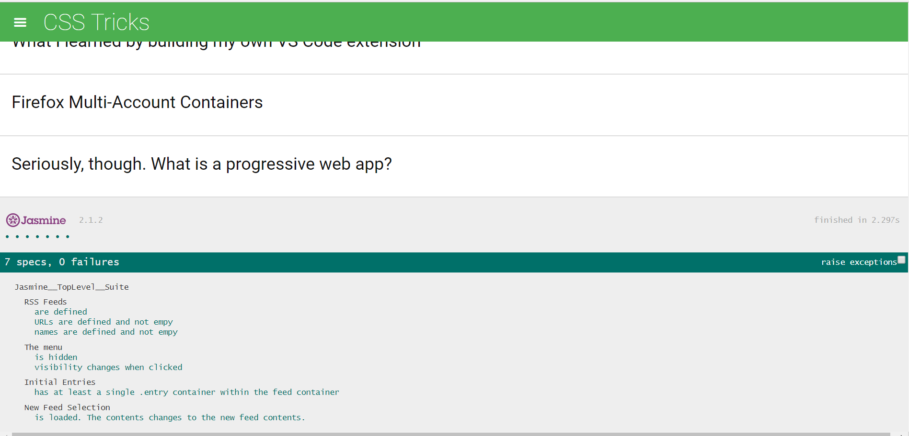

Feed Reader Testing
===============================

This project was done as a part of the Udacity Front-End Web Developer Nanodegree Program.
The starter file for this project is located at https://github.com/udacity/frontend-nanodegree-feedreader.
To see the live version of this project, click
 https://pikabe.github.io/feedreader/ .

 Project Description
 ---
 For this project, the JavaScript testing framework [Jasmine](http://jasmine.github.io/) was used to test the functionality of the an RSS feed reader application.

 ### Tests Passed ###

 * Each feed URL is defined and that the URL is not empty.
 * Each feed name is defined and is not empty.
 * The menu element is hidden by default.
 * The menu changes visibility when clicked.
 * When feeds are loaded, at least one entry for the feed.
 * When a new feed is loaded, the content actually changes.

Installation
---
To download this project,
1) Click the Clone or Download button then Download Zip.
2) Once downloaded, open the file and click on the index.html file to open the project on your browser.
